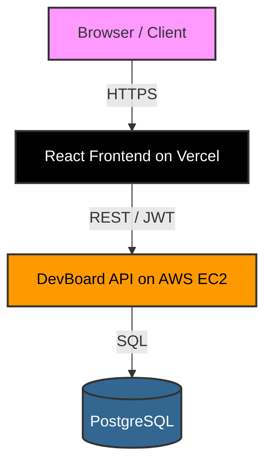

# Mutum Frontend


## Project Description

**Mutum** is a modern, responsive, and highly performant task and project management web application. Built with React and TypeScript, it offers a seamless Apple-inspired user experience for managing software projects, tasks, and team productivity. It integrates with the production **Mutum API**, providing secure and scalable backend functionality.

## Live Demo

- **Frontend Application**: [https://app.labprojects.dev.br](https://app.labprojects.dev.br)
- **Backend API**: [https://api.labprojects.dev.br](https://api.labprojects.dev.br)
- **API Documentation (Swagger)**: [https://api.labprojects.dev.br/docs](https://api.labprojects.dev.br/docs)

## Features

- **Authentication & Security:**
  - Secure Login and Sign Up.
  - JWT Authentication with protected routes.
  - Comprehensive User Approval Workflow.
- **Dashboard & Workflows:**
  - **Projects CRUD:** Create, read, update, and delete projects.
  - **Tasks CRUD:** Detailed task management tied to specific projects.
  - **Custom Delete Actions:** Apple-like custom modals for irreversible actions.
  - **Intelligent Sorting & Filtering:** Context-aware status filtering and priority sorting.
- **UI / UX:**
  - **Dark/Light Theme:** Native system-aware theme toggling.
  - **Responsive Design:** Optimized for mobile, tablet, and desktop viewing.

## Tech Stack

- **Framework:** React 18
- **Language:** TypeScript
- **Bundler:** Vite
- **Styling:** CSS Modules (Vanilla CSS, no external UI libraries)
- **Routing:** React Router v6
- **State Management:** React Hooks
- **Network:** Native Fetch API

## System Architecture

The DevBoard ecosystem is split into a highly responsive client-side application and a robust REST API.

- **Frontend (Client)**: Built with **React 18**, **TypeScript**, and **Vite**. Styled via Vanilla CSS Modules.
- **Backend (Server)**: Built with **FastAPI** (Python) offering automatic Swagger documentation and extremely fast execution.
- **Database**: Relational data mapped via SQL on **PostgreSQL**.
- **Authentication**: Stateless, secure **JWT (JSON Web Tokens)** isolating tenant workspaces.
- **Hosting / Infrastructure**:
  - The Frontend is continuously deployed globally on **Vercel** (`app.labprojects.dev.br`).
  - The Backend API runs inside an **AWS EC2** instance (`api.labprojects.dev.br`).



## Authentication Flow

Authentication ensures strict tenant isolation and endpoint protection. 

1. **Token Generation:** Upon successful login, the DevBoard API provides a JWT.
2. **Local Storage:** The token is stored securely in the client browser.
3. **Protected Routes:** React Router intercepts unauthenticated visits to the dashboard and redirects to `/login`.
4. **Header Injection:** All outgoing requests to the `/api/v1/` endpoints include the `Authorization: Bearer <token>` header.

## User Approval Flow

To maintain strict security and accountability, DevBoard utilizes a manual review process for new users:

1. **Sign Up:** User submits an email and password via the frontend.
2. **Pending:** The backend creates the user with a `PENDING` status. Attempting to log in returns a `403 Forbidden` response.
3. **Admin Approval:** An administrator manually verifies and updates the user's status to `ACTIVE` in the PostgreSQL database.
4. **Login:** The user can now successfully authenticate and receive a JWT.
5. **Dashboard:** The user gains full access to their isolated tenant on the DevBoard.

## Screenshots

*(Placeholders for future screenshots)*

| Login & Sign Up | Dashboard (Light Mode) | Dashboard (Dark Mode) |
| :---: | :---: | :---: |
|  |  |  |

## Running Locally

To run the DevBoard frontend locally:

1. **Clone the repository:**
   ```bash
   git clone <repository_url>
   cd devboard-frontend
   ```

2. **Install dependencies:**
   ```bash
   npm install
   ```

3. **Start the development server:**
   ```bash
   npm run dev
   ```

4. **Build for production:**
   ```bash
   npm run build
   ```

## Environment Variables

Currently, the application natively connects to the production DevBoard API endpoint without requiring local `.env` variables for the base configuration. 
Future environments (Staging, Local) can be configured via Vite's `.env` capabilities.

## Integration with DevBoard API

The frontend connects directly to `https://api.labprojects.dev.br`. Key integrated routes include:

- `POST /api/v1/auth/login` - Authentication
- `POST /api/v1/users/` - User Registration
- `GET/POST/DELETE /api/v1/projects/` - Project Management
- `GET/POST/PATCH/DELETE /api/v1/tasks/` - Task Management

## Project Structure

```text
src/
├── components/       # Reusable UI components (Button, Input, Card, Modal, etc.)
├── pages/            # View-level components (Login, Dashboard)
├── router/           # React Router configuration and ProtectedRoutes
├── services/         # API integration (Fetch wrappers, Auth Storage)
├── types/            # TypeScript interfaces and schemas
├── App.tsx           # Root Application Component
└── main.tsx          # React DOM entry point
```

## Design System

The application strictly adheres to a predefined design philosophy tailored for a premium user experience.

- **Apple-inspired:** Clean borders, soft shadows, rounded corners, and native-feeling interactions.
- **Minimalism:** Removing noise. No unnecessary emojis, heavy external CSS libraries, or cluttered layouts.
- **Accessibility:** High-contrast tokens, readable Google fonts, semantic HTML, and proper focus states.
- **Consistency:** Centralized CSS variables for colors, spacing, and typography to maintain uniform aesthetics across Light and Dark themes.

## Production Environment

The frontend is built using Vite, resulting in a highly optimized, minified bundle (~64kB gzipped).
The application is automatically deployed to **Vercel**, which provides a blazing-fast global Edge CDN.

All production API calls are securely routed to the official backend domain via HTTPS: `https://api.labprojects.dev.br`.

## Future Improvements

- Implementing drag-and-drop task reordering (Kanban view).
- Real-time WebSockets synchronization.
- Granular user roles and permissions within projects.

## Author

**Eduardo Santana**  
*Software Engineer & Architect*
